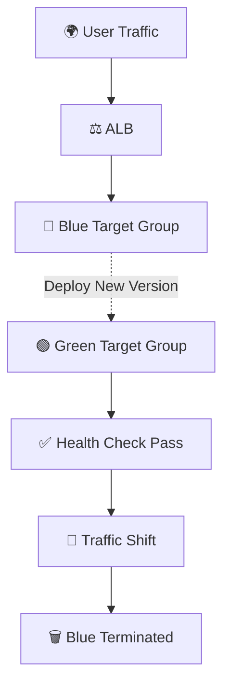

# 🔵🟢 Blue-Green Deployment on AWS ECS

---

# 📘 What is Blue-Green Deployment?

```
🔵 Blue  → Current Live Version
🟢 Green → New Updated Version

Traffic shifts only after validation.
Zero Downtime ✅
Easy Rollback ✅
```

---

# 🏗️ 1. Setup AWS Infrastructure

## ☁️ Services Used

```
✔ Amazon ECS
✔ AWS CodeDeploy
✔ AWS CodePipeline
✔ Amazon CloudWatch
✔ Application Load Balancer
```

## 🛠️ Steps

```
1️⃣ Create ECS Cluster (Fargate / EC2)
2️⃣ Create ECS Service attached to ALB
3️⃣ Configure CodeDeploy (Blue-Green)
4️⃣ Create Two Target Groups (Blue & Green)
```

---

# ⚙️ 2. Create IAM Roles & Policies

## 🎭 Required Roles

```
ecsTaskExecutionRole
CodeDeployRole
CodePipelineRole
```

## 📜 Attach Policies

```
AmazonECS_FullAccess
AWSCodeDeployRoleForECS
ElasticLoadBalancingFullAccess
CloudWatchLogsFullAccess
```

---

# 🌐 3. Setup Application Load Balancer (ALB)

## Configuration

```
✔ Create ALB (Public Subnets)
✔ Create Blue Target Group
✔ Create Green Target Group
✔ Create HTTP/HTTPS Listener
✔ Forward Traffic → Blue (Initially)
```

```
CodeDeploy shifts traffic → Green during deployment
```

---

# 🔵 4. Deploy First Version (Blue)

```
✔ Register Task Definition (v1)
✔ Create ECS Service
✔ Attach Blue Target Group
✔ Desired Count ≥ 1
```

## ✅ Verify

```
✔ Application accessible via ALB DNS
✔ Health checks passing
```

---

# 🔁 5. Configure AWS CodeDeploy

## Create Application

```
Compute Platform → ECS
```

## Create Deployment Group

```
✔ Link ECS Cluster & Service
✔ Select Blue & Green Target Groups
✔ Choose Traffic Shifting:

   • All-at-once
   • Linear
   • Canary

✔ Enable Automatic Rollback
```

---

# 🚀 6. Deploy New Version (Green)

## CI/CD Workflow

```
Push Code → GitHub
        ↓
CodePipeline Triggered
        ↓
Build (Optional CodeBuild)
        ↓
Push Docker Image → ECR
        ↓
Update Task Definition
        ↓
CodeDeploy:
   • Launch Green Tasks
   • Validate Health
   • Shift Traffic Blue → Green
   • Terminate Blue (After Success)
```

```
Zero Downtime Deployment 🎯
```

---

# 📊 7. Monitor & Rollback

## 🔍 Monitoring

```
✔ CloudWatch Logs
✔ ALB Health Checks
✔ 5xx Error Alarms
✔ CPU & Memory Metrics
```

## 🔁 Rollback Scenario

```
If Green Fails:
   → CodeDeploy shifts traffic back to Blue
   → Blue remains active
```

---

# 🔄 Deployment Flow Summary



---

# 🌈 Architecture Flow

```
User → ALB → Blue (Live)

Deploy New Version →
Green Launched →
Health Check →
Traffic Shift →
Blue Removed 🚀
```