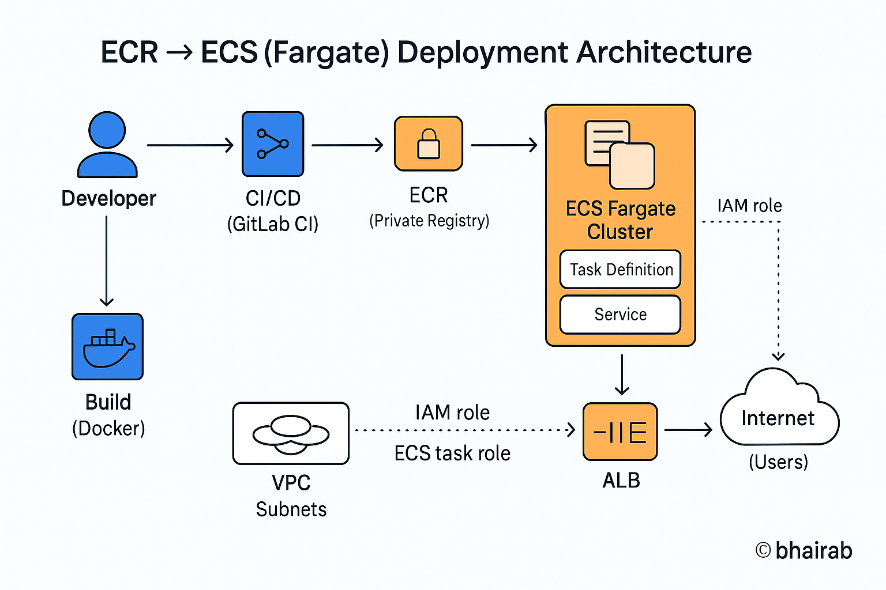
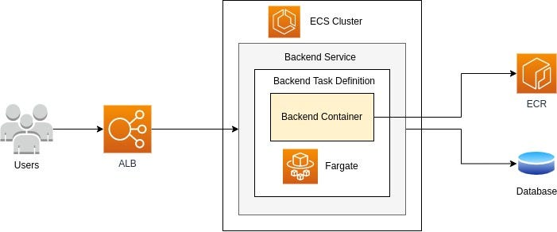
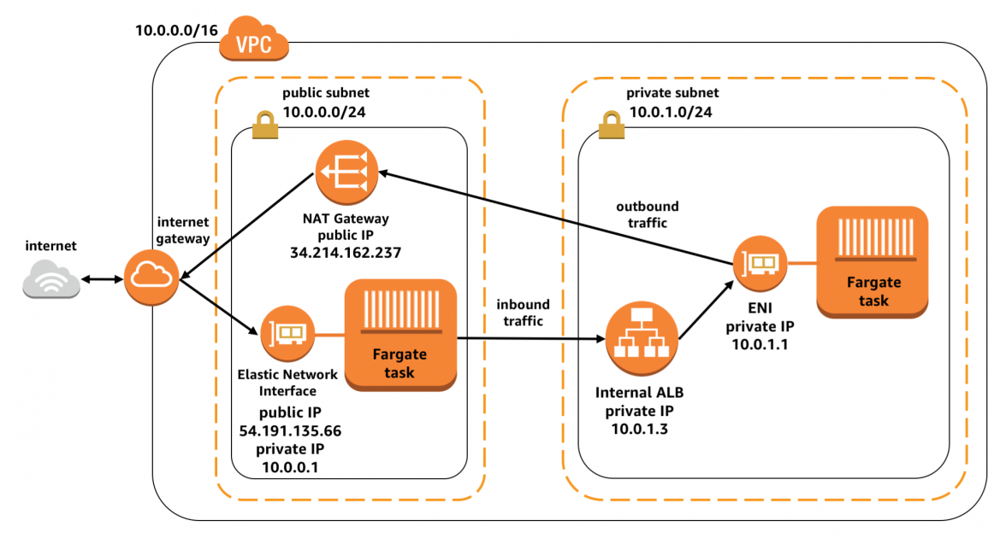
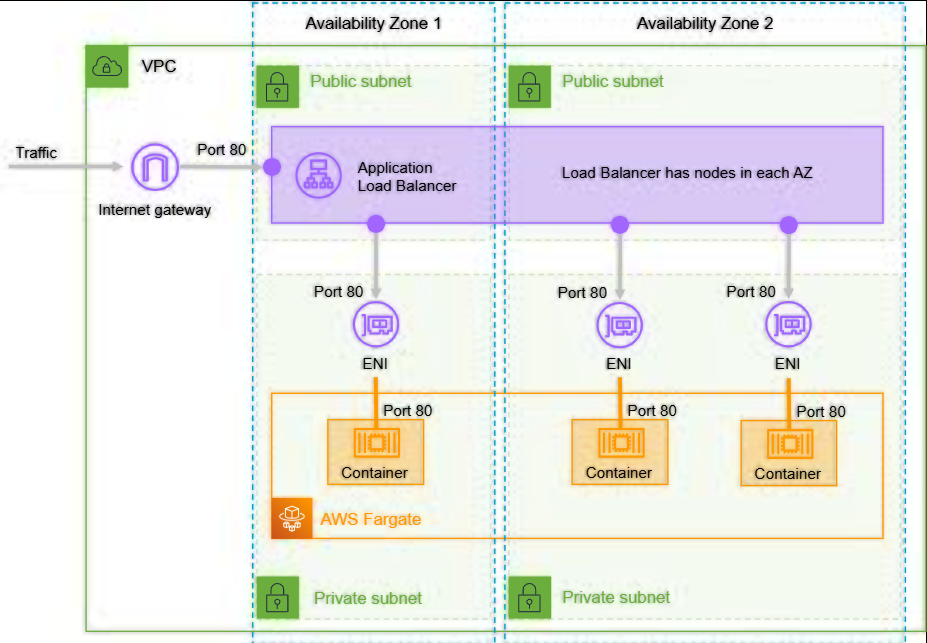

# 🚀 Containerized Deployment using AWS ECS Fargate

## 📌 Overview

This project demonstrates serverless container deployment using:

- Amazon ECS
- AWS Fargate
- Amazon ECR
- Docker

## 🏗️ Architecture

Docker → ECR → ECS → Fargate

## ⚙️ Features

✔ Serverless container hosting  
✔ No EC2 management  
✔ Scalable & highly available  
✔ CloudWatch logging  

## 📸 Screenshots

---

---

---

---

## 🚀 Deployment Steps

1. Build Docker image
2. Push to ECR
3. Create ECS cluster
4. Register task definition
5. Run service using Fargate

## 👨‍💻 Author

<a href = "https://cinch-revamp-60906406.figma.site/"> Mr.Aniket A Firke</a>
