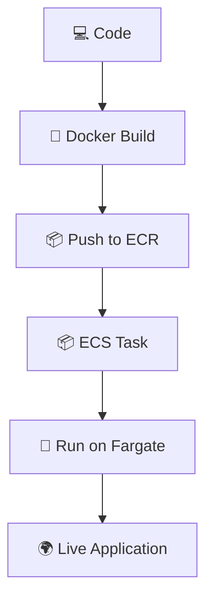

# ☁️ Create ECR Repository

```
aws ecr create-repository --repository-name my-fargate-app
```

---

# 🔐 Authenticate Docker to ECR

```
aws ecr get-login-password --region us-east-1 \
| docker login --username AWS --password-stdin \
<AWS_ACCOUNT_ID>.dkr.ecr.us-east-1.amazonaws.com
```

---

# 🏗️ Build & Push Image

## Build Docker Image
```
docker build -t my-fargate-app .
```

## Tag Image
```
docker tag my-fargate-app:latest \
<AWS_ACCOUNT_ID>.dkr.ecr.us-east-1.amazonaws.com/my-fargate-app:latest
```

## Push Image
```
docker push \
<AWS_ACCOUNT_ID>.dkr.ecr.us-east-1.amazonaws.com/my-fargate-app:latest
```

---

# ⚙️ Create ECS Cluster

```
aws ecs create-cluster --cluster-name my-fargate-cluster
```

---

# 📦 Register Task Definition

```
aws ecs register-task-definition \
--cli-input-json file://task-def.json
```

---

# 🌐 Create ECS Service (Fargate)

```
aws ecs create-service \
--cluster my-fargate-cluster \
--service-name my-fargate-service \
--task-definition my-fargate-task \
--launch-type FARGATE \
--network-configuration "awsvpcConfiguration={subnets=[subnet-abc123],securityGroups=[sg-abc123],assignPublicIp=ENABLED}" \
--desired-count 1
```

---

# ✅ Verify Deployment

## 🟢 Running Tasks
```
aws ecs list-tasks --cluster my-fargate-cluster
```

## 📜 CloudWatch Logs
```
aws logs describe-log-streams \
--log-group-name /ecs/my-fargate-app
```

---

# 🌍 Access Application

```
Use Public IP of the running task
```

```
🚀 Deployed on AWS Fargate using ECS
```

---

# 🧹 Cleanup

## Delete Service
```
aws ecs delete-service \
--cluster my-fargate-cluster \
--service my-fargate-service --force
```

## Delete Cluster
```
aws ecs delete-cluster --cluster my-fargate-cluster
```

## Delete ECR Repository
```
aws ecr delete-repository \
--repository-name my-fargate-app --force
```

---

# 🔄 Deployment Flow



---

# 🌈 Flow Overview

```
Code → Docker → ECR → ECS → Fargate → Live App 🚀
```