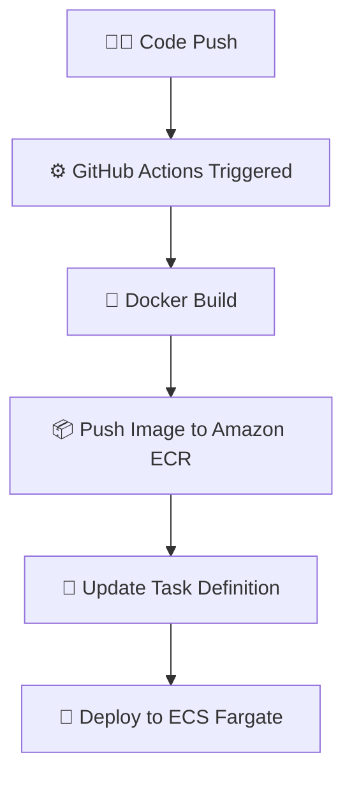

# 🚀 GitHub Actions + AWS ECS CI/CD Project

## 📌 Overview
This project demonstrates a complete CI/CD pipeline using:

- GitHub Actions
- Docker
- Amazon ECR
- Amazon ECS (Fargate)

The pipeline automatically builds a container image and deploys it to ECS whenever code is pushed to the main branch.

---

## 🏗️ Architecture

GitHub → GitHub Actions → Amazon ECR → Amazon ECS (Fargate)

---

## ⚙️ Prerequisites

- AWS Account
- ECS Cluster & Service
- ECR Repository
- GitHub Secrets configured

---

## 🚀 Deployment Flow

1. Push code to GitHub
2. GitHub Actions builds Docker image
3. Image pushed to ECR
4. ECS service updated automatically

---

## 🌐 Application Output

Flask app running on AWS ECS Fargate.

---

# 🔐 GitHub Secrets

```
Repo → Settings → Secrets → Actions
```

```
AWS_ACCESS_KEY_ID
AWS_SECRET_ACCESS_KEY
AWS_REGION
ECR_REPOSITORY_NAME
ECS_CLUSTER
ECS_SERVICE
```

---

# ☁️ AWS Setup (One-Time)

## 1️⃣ Create ECR Repository
```
aws ecr create-repository \
--repository-name my-repo
```

## 2️⃣ Create ECS Cluster
```
aws ecs create-cluster \
--cluster-name my-cluster
```

## 3️⃣ Register Task Definition
```
aws ecs register-task-definition \
--cli-input-json file://task-definition.json
```

## 4️⃣ Create ECS Service (Fargate)
```
aws ecs create-service \
--cluster my-cluster \
--service-name my-service \
--task-definition my-task \
--desired-count 1 \
--launch-type FARGATE \
--network-configuration "awsvpcConfiguration={subnets=[subnet-id],securityGroups=[sg-id],assignPublicIp=ENABLED}"
```
---
# 🔄 CI/CD Flow


---
# 🌈 CI/CD Pipeline Overview

```
Code Push
   ↓
GitHub Actions
   ↓
Docker Build
   ↓
Push → Amazon ECR
   ↓
Update Task Definition
   ↓
Deploy → ECS Fargate 🚀
```
---

## 👨‍💻 Author


<a href = "https://cinch-revamp-60906406.figma.site/"> Mr. Aniket A Firke</a>

