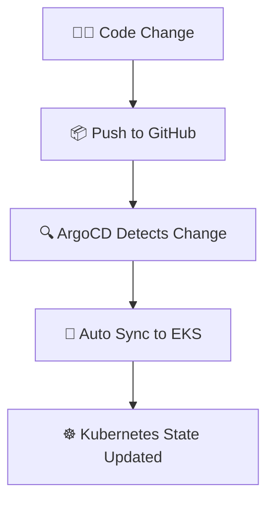

# ☸️ Create EKS Cluster

```
eksctl create cluster \
--name gitops-eks \
--region us-east-1 \
--nodegroup-name worker-nodes \
--node-type t3.medium \
--nodes 2
```

## ✅ Validate Cluster
```
kubectl get nodes
```

---

# ⚙️ Install ArgoCD

## Create Namespace
```
kubectl create namespace argocd
```

## Add Helm Repo
```
helm repo add argo https://argoproj.github.io/argo-helm
```

## Install ArgoCD
```
helm install argocd argo/argo-cd -n argocd
```

## 🔍 Check Pods
```
kubectl get pods -n argocd
```

---

# 🌐 Access ArgoCD UI

## Port Forward
```
kubectl port-forward svc/argocd-server -n argocd 8080:443
```

## 🔐 Get Admin Password
```
kubectl -n argocd get secret argocd-initial-admin-secret \
-o jsonpath="{.data.password}" | base64 --decode
```

## 🔑 Login
```
argocd login localhost:8080
```

---

# ▶️ Deploy the GitOps Application
```
kubectl apply -f argocd/app.yaml
```

---

# ✅ Verify Deployment
```
kubectl get pods
kubectl get svc
```

```
Open ArgoCD UI → App Status → Healthy & Synced
```

---

# 🔄 GitOps Workflow



---

# 🧹 Cleanup

```
eksctl delete cluster --name gitops-eks
```

---

# 🌈 Flow Overview

```
GitHub → ArgoCD → EKS → Kubernetes Deployment 🚀
```