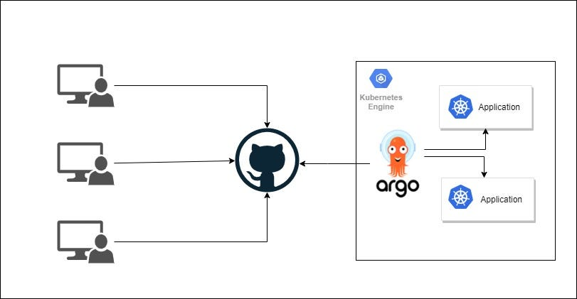
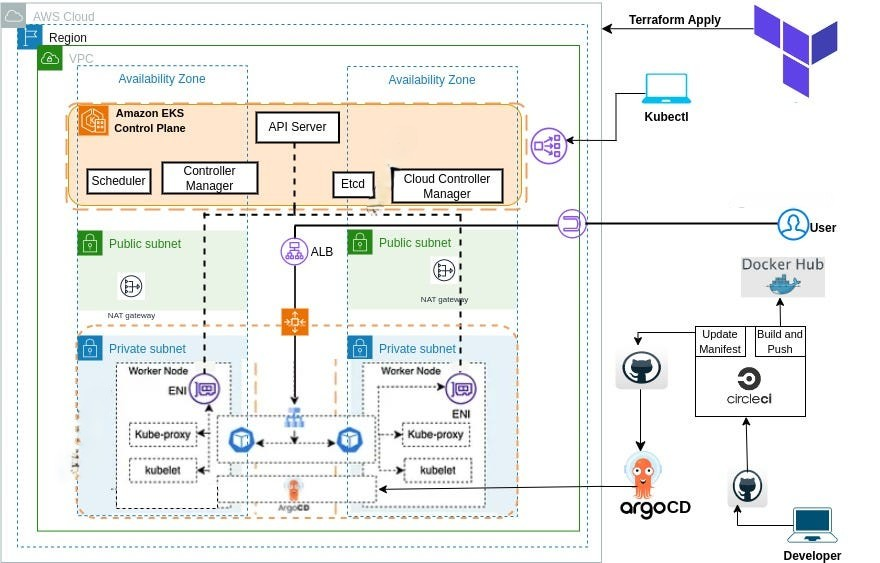
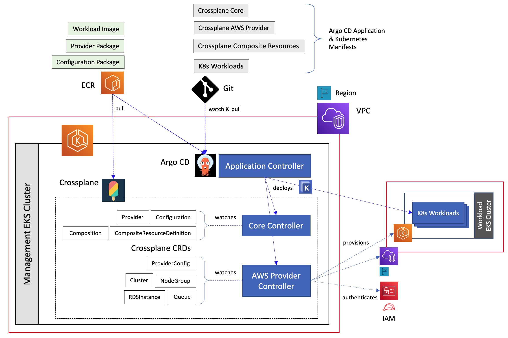

# 🚀 Kubernetes GitOps with ArgoCD on AWS EKS

## 📌 Overview

This project implements GitOps-based continuous delivery using:

- AWS EKS
- ArgoCD
- Helm
- Kubernetes

ArgoCD continuously monitors the Git repository and ensures the cluster state matches the desired state.

---

## 🏗️ Architecture

GitHub → ArgoCD → AWS EKS → Kubernetes Deployment

---

## ⚙️ Features

✔ Git as single source of truth  
✔ Automated deployments  
✔ Self-healing & auto-sync  
✔ LoadBalancer service on AWS  

---

## 🚀 Deployment Flow

1. Push Kubernetes manifests to GitHub
2. ArgoCD detects changes
3. Automatically syncs with EKS

---

## 📸 Screenshots 

---

---

---

---
## 👨‍💻 Author

<a href = "https://cinch-revamp-60906406.figma.site/"> Mr.Aniket A Firke</a>