# 🚀 Launch EC2 → Install Jenkins

## 🖥️ Update Packages
```
sudo apt update
```

## ☕ Install Java
```
sudo apt install openjdk-11-jdk -y
```

## 🔑 Add Jenkins Key
```
curl -fsSL https://pkg.jenkins.io/debian-stable/jenkins.io.key | sudo tee \
/usr/share/keyrings/jenkins-keyring.asc > /dev/null
```

## 📦 Add Jenkins Repository
```
echo deb [signed-by=/usr/share/keyrings/jenkins-keyring.asc] \
https://pkg.jenkins.io/debian-stable binary/ | sudo tee \
/etc/apt/sources.list.d/jenkins.list > /dev/null
```

## 🔄 Update Packages
```
sudo apt update
```

## ⚙️ Install Jenkins
```
sudo apt install jenkins -y
```

---

# ▶️ Start Jenkins

```
sudo systemctl enable jenkins
sudo systemctl start jenkins
```

---

# 🔐 Get Initial Admin Password

```
sudo cat /var/lib/jenkins/secrets/initialAdminPassword
```

---

# 🌈 Flow

```mermaid
flowchart TD
    A[🖥️ Launch EC2] --> B[☕ Install Java]
    B --> C[📦 Install Jenkins]
    C --> D[▶️ Start Jenkins Service]
    D --> E[🔐 Get Admin Password]
    E --> F[🌍 Access Jenkins UI]
```


