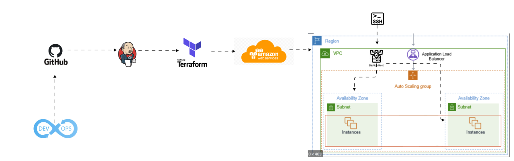
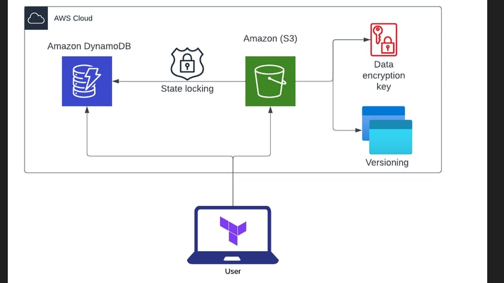
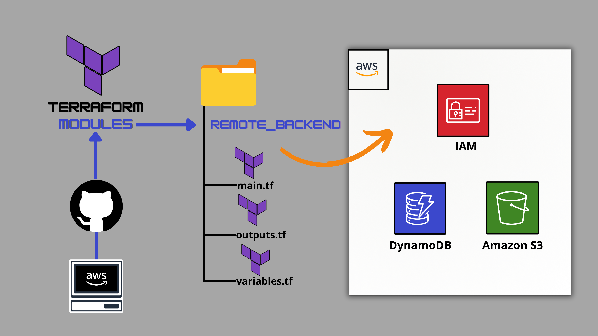

# 🚀 Jenkins CI/CD with Terraform on AWS

## 📌 Overview

This project automates AWS infrastructure provisioning using:

- Jenkins
- Terraform
- AWS EC2
- S3 (Remote State)
- DynamoDB (State Locking)

---

## 🏗️ Architecture

GitHub → Jenkins → Terraform → AWS

---

## ⚙️ Features

✔ Infrastructure as Code  
✔ Automated CI/CD pipeline  
✔ Remote Terraform state  
✔ State locking with DynamoDB  

---

## 🚀 Pipeline Flow

1. Developer pushes code
2. Jenkins triggers pipeline
3. Terraform initializes backend
4. Terraform provisions AWS resources

---

## 📸 Screenshots 

---

---

---

---

## 👨‍💻 Author

<a href = "https://cinch-revamp-60906406.figma.site/"> Mr. Aniket A Firke</a>

