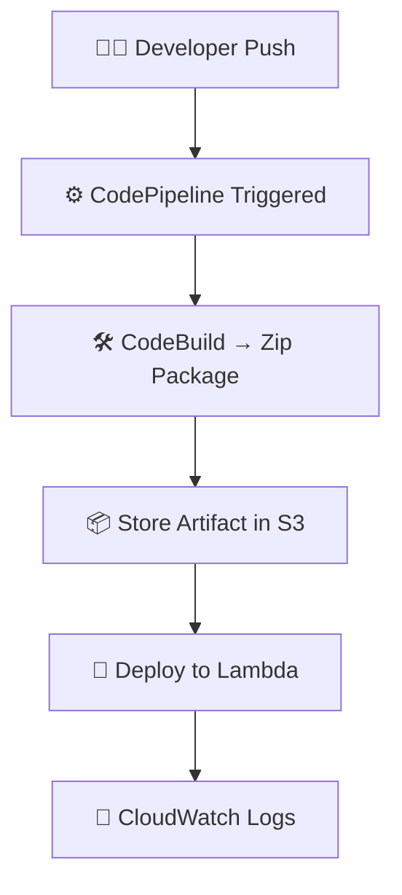

# ☁️ Create Lambda Function

**Runtime:** Node.js 18  

**IAM Role Permissions**

```
✔ AWSLambdaBasicExecutionRole
✔ AmazonS3ReadOnlyAccess
```

---

# 🏗️ CodePipeline Setup

## 📌 Pipeline Stages

```
1️⃣ Source  → CodeCommit / GitHub
2️⃣ Build   → CodeBuild
3️⃣ Deploy  → Lambda
```

---

# 🚀 Deploy Command (Deploy Stage)

```
aws lambda update-function-code \
--function-name MyLambdaFunction \
--s3-bucket my-artifact-bucket \
--s3-key app.zip
```

---

# ⚡ EventBridge Trigger

## Create Rule

```
Event Source → CodeCommit / GitHub Push
Target       → CodePipeline
```

```
Code Push → Auto Pipeline Trigger 🚀
```

---

# 🔍 Validate Deployment

## 📜 CloudWatch Logs

```
aws logs tail /aws/lambda/MyLambdaFunction --follow
```

## 🧪 Test Function

```
✔ Lambda Console
✔ API Gateway
✔ AWS CLI
```

---

# 🔄 CI/CD Flow



---

# 🌈 Flow Overview

```
Developer → CodePipeline → CodeBuild → S3 → Lambda → CloudWatch ✅
```