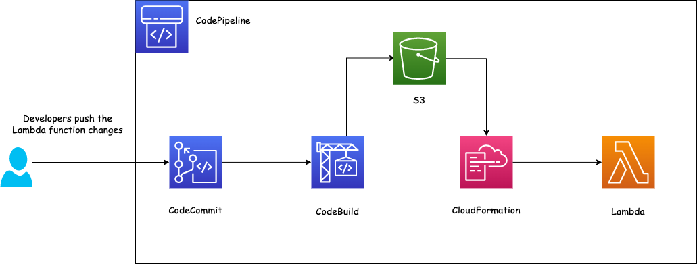
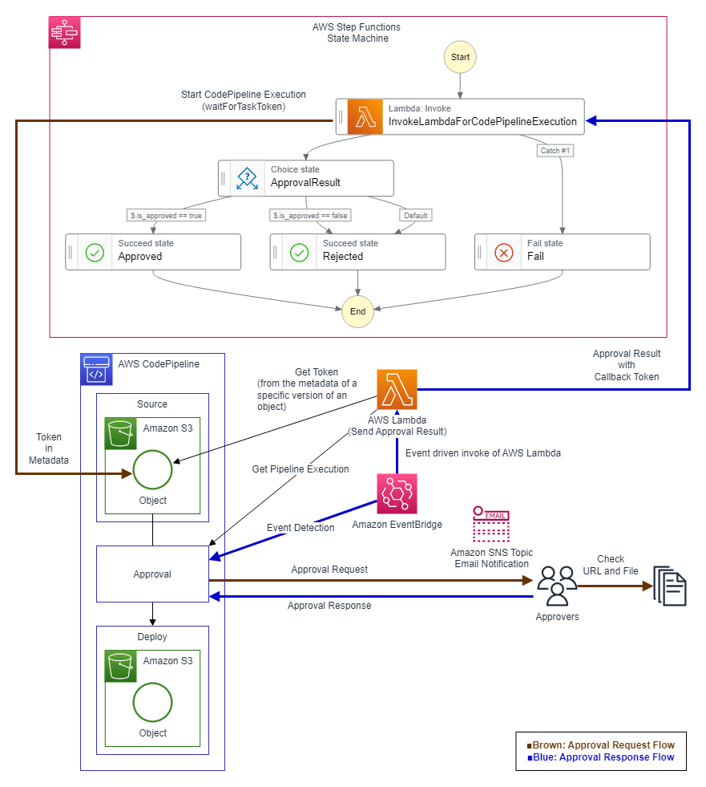

# 🚀 Lambda-Based Serverless CI/CD Pipeline

## 📌 Overview

This project implements a fully automated serverless deployment pipeline using:

- AWS CodePipeline
- AWS CodeBuild
- AWS Lambda
- Amazon S3
- Amazon EventBridge

---

## 🏗️ Architecture

Source → CodeBuild → S3 → Lambda Deployment

---

## ⚙️ Features

✔ Fully serverless CI/CD  
✔ Automatic deployment on code push  
✔ Event-driven pipeline  
✔ CloudWatch monitoring  

---

## 🚀 Deployment Flow

1. Push code to repository
2. CodePipeline triggers automatically
3. CodeBuild packages application
4. Lambda function updated

---

## 📸 Screenshots 

---

---

---

---

## 👨‍💻 Author

<a href = "https://cinch-revamp-60906406.figma.site/"> Mr.Aniket A Firke</a>
