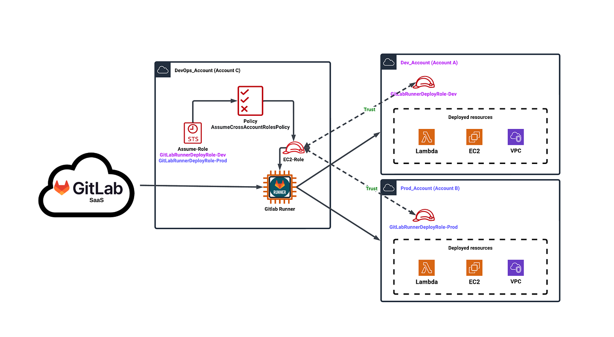
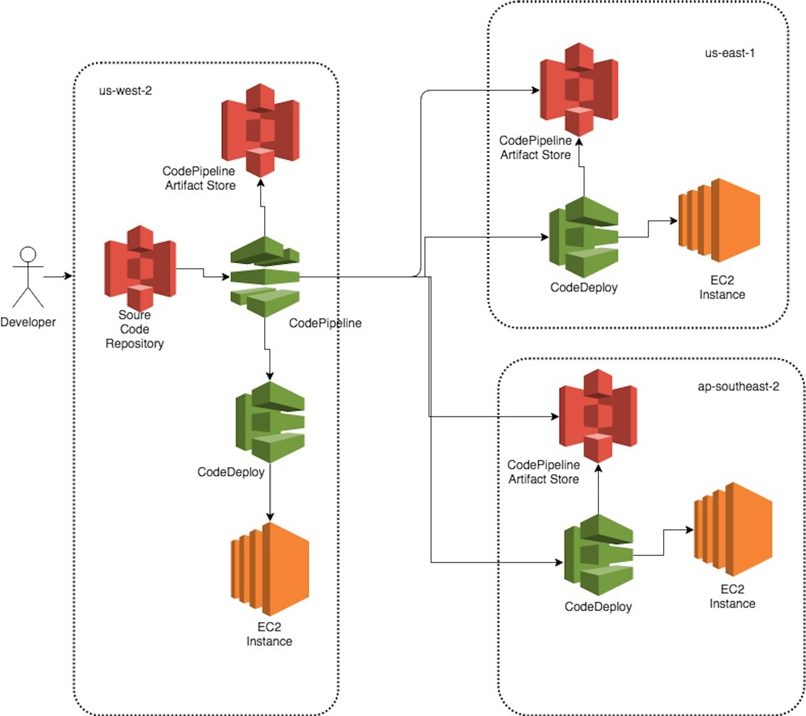
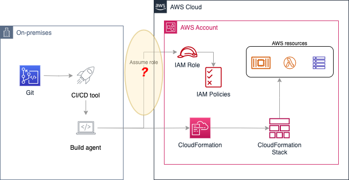

# 🚀 Multi-Account CI/CD Pipeline with AWS CodePipeline

## 📌 Overview

This project demonstrates a secure CI/CD pipeline deploying applications across multiple AWS accounts.

## 🏗️ Architecture

Management Account → Staging → Production

## ⚙️ Features

- Cross-account deployment using IAM roles
- Automated CI/CD pipeline
- Manual approval for production
- Environment isolation

## 🚀 Deployment Flow

1. Code pushed to repository
2. CodeBuild builds the application
3. Deployment to staging
4. Manual approval
5. Deployment to production

## 📸 Screenshots 

---

---

.png>)

---

---

## 🔐 Security

- STS AssumeRole
- Least privilege access
- No credential sharing

## 👨‍💻 Author

<a href = "https://cinch-revamp-60906406.figma.site/"> Mr.Aniket A Firke</a>
