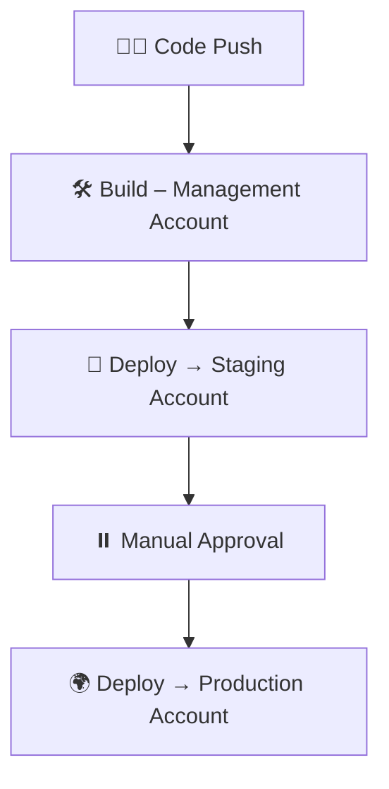

# ⚙️ Prerequisites

```
✔ 3 AWS Accounts (Dev / Staging / Prod)
✔ AWS CLI configured with profiles
✔ Artifact S3 bucket in Management account
✔ GitHub / CodeCommit repository
```

---

# 🔐 Cross-Account IAM Role Setup

## 📍 Create Role in Staging & Production Accounts

### Trust Policy

```json
{
  "Version": "2012-10-17",
  "Statement": [
    {
      "Effect": "Allow",
      "Principal": {
        "AWS": "arn:aws:iam::<MANAGEMENT_ACCOUNT_ID>:root"
      },
      "Action": "sts:AssumeRole"
    }
  ]
}
```

### Attach Policy

```
AWSCodeDeployRole
```

### 📌 Save

```
Role ARN → Used in CodePipeline
```

---

# 🏗️ Create CodePipeline (Management Account)

## Stage 1 – Source

```
✔ GitHub / CodeCommit
✔ Branch → main
```

## Stage 2 – Build

```
✔ AWS CodeBuild
✔ buildspec.yml
```

## Stage 3 – Deploy to Staging (Cross-Account)

```
Provider → CodeDeploy
Cross-account Role ARN → Staging
```

## Stage 4 – Manual Approval

```
Production safety gate
```

## Stage 5 – Deploy to Production

```
Cross-account Role ARN → Production
```

---

# 🔄 Pipeline Flow



---

# 🧪 Test the Pipeline

```
git commit -m "multi account deployment"
git push
```

```
✅ Verify Deployment

✔ Staging Account
✔ Production Account
```

---

# 🛡️ Security Best Practices Implemented

```
✔ Account isolation
✔ STS AssumeRole
✔ No long-term credentials
✔ Manual approval for production
✔ Artifact encryption via S3
```

---

# 🌈 Flow Overview

```
Management Account
        ↓
Build
        ↓
Staging Deployment
        ↓
Manual Approval
        ↓
Production Deployment 🚀
```
