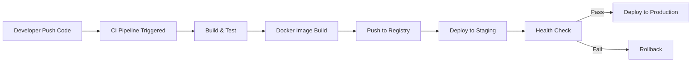

# 🚀 CI/CD Projects

Welcome to the **CI/CD Projects Repository**. This repository contains 8 hands-on DevOps and Cloud projects designed to demonstrate practical implementation of CI/CD pipelines using AWS and container technologies.

---

# 📌 Projects Overview

1. Static Website Deployment using S3 + CloudFront
2. CI/CD Pipeline using GitHub Actions
3. Dockerized Application Deployment
4. Kubernetes Deployment with Rolling Updates
5. Infrastructure as Code using Terraform
6. Containerized Deployment with AWS Fargate
7. Monitoring & Logging with CloudWatch
8. Blue-Green Deployment on AWS ECS

---

# 📂 File Structure Flow Chart

graph TD
    Root[CI-CD-Projects]
    Root --> P1[project-1-static-site]
    Root --> P2[project-2-github-actions]
    Root --> P3[project-3-docker]
    Root --> P4[project-4-kubernetes]
    Root --> P5[project-5-terraform]
    Root --> P6[project-6-fargate]
    Root --> P7[project-7-monitoring]
    Root --> P8[project-8-blue-green]

# 🧩 Project 1: Static Website Deployment (S3 + CloudFront)

## Objective

Deploy a static website with global CDN distribution.

## Tools Used

* Amazon S3
* CloudFront
* Route 53

## Workflow

Developer → Git Push → S3 Upload → CloudFront Distribution → End Users

---

# 🧩 Project 2: CI/CD Pipeline using GitHub Actions

## Objective

Automate build, test, and deployment using GitHub Actions.

## Workflow

Git Push → GitHub Actions → Build → Test → Deploy to Server

## Sample YAML Flow

```yaml
on: push
jobs:
  build:
    runs-on: ubuntu-latest
    steps:
      - uses: actions/checkout@v2
      - run: npm install
      - run: npm test
```

---

# 🧩 Project 3: Dockerized Application Deployment

## Objective

Containerize and deploy application using Docker.

## Flow

App Code → Docker Build → Docker Image → Docker Hub/ECR → Server Pull → Run Container

---

# 🧩 Project 4: Kubernetes Rolling Deployment

## Objective

Deploy containerized app with zero downtime updates.

## Flow

Docker Image → Kubernetes Deployment → Rolling Update → Pods Updated Gradually

---

# 🧩 Project 5: Infrastructure as Code (Terraform)

## Objective

Provision AWS infrastructure using Terraform.

## Flow

Terraform Code → terraform init → terraform plan → terraform apply → AWS Resources Created

---

# 🧩 Project 6: Containerized Deployment with AWS Fargate

## Objective

Deploy container without managing servers.

## Flow

Docker Build → Push to ECR → ECS Task Definition → ECS Service → Fargate Launch → Load Balancer

---

# 🧩 Project 7: Monitoring & Logging with CloudWatch

## Objective

Monitor applications and infrastructure.

## Flow

Application Logs → CloudWatch Logs → Metrics → Alarms → Notifications (SNS)

---

# 🧩 Project 8: Blue-Green Deployment on AWS ECS

## Objective

Deploy new application version with zero downtime.

## Flow

Blue Environment (Live)
↓
Deploy Green Version
↓
Health Check Validation
↓
Traffic Shift (ALB)
↓
Blue Terminated (If Success)

---

# 🎬 Animated Deployment Flow (Conceptual)



---


## Design Concept: "Modern Cloud Control Panel"

### 🔵 Color Theme

* Primary: Deep Blue (#0A192F)
* Accent: Neon Cyan (#00FFFF)
* Success: Green (#00C853)
* Alert: Red (#FF1744)

### 🧭 Layout Structure

* Left Sidebar: Services (ECS, ECR, ALB, CI/CD)
* Top Bar: Environment Switch (Dev / Staging / Prod)
* Main Panel: Deployment Status Cards
* Right Panel: Logs + Metrics

### 📊  Components

* Real-time Deployment Progress Bar
* Animated Traffic Shift Indicator (Blue → Green)
* Auto Refresh Logs Window
* Error Highlight System

### 🔄 Micro Animations

* Pipeline stages light up sequentially
* Traffic arrows animate during shift
* Success checkmark animation
* Rollback red flash indicator

---

# 📈 CI/CD Master Flow Summary

Developer → Version Control → CI Build → Test → Containerize → Push → Deploy → Monitor → Rollback (if needed)

---

# 🏆 Key Skills Demonstrated

* Continuous Integration
* Continuous Deployment
* Containerization
* Infrastructure Automation
* Cloud Monitoring
* Zero Downtime Deployment
* DevOps Best Practices

---

# 📌 Conclusion

This repository demonstrates real-world DevOps implementations covering complete CI/CD lifecycle from development to production deployment with monitoring and rollback strategies.

---

# 👨‍💻 Author

<a href = "https://cinch-revamp-60906406.figma.site/"> Mr.Aniket A Firke</a>
DevOps & Cloud Engineer | CI/CD Enthusiast | AWS Practitioner

---

