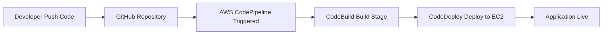
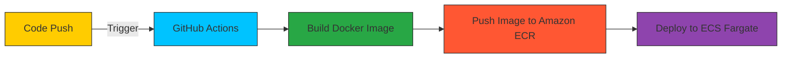
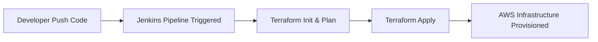
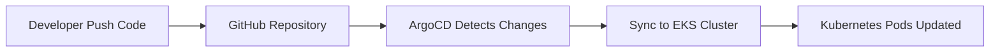
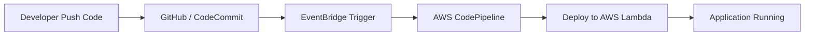
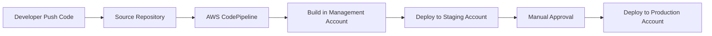
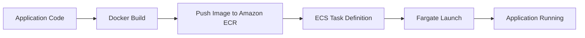
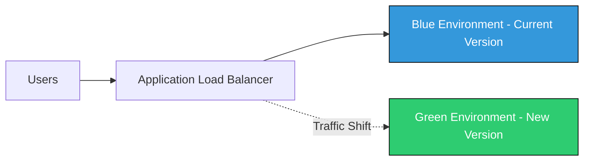

# 🚀 CI/CD Projects Portfolio

Welcome to the **CI/CD Projects Repository** — a hands-on DevOps portfolio showcasing real-world Continuous Integration and Continuous Deployment implementations using AWS, Docker, Kubernetes, and Infrastructure as Code.

This repository demonstrates production-style deployment workflows from development to monitoring with zero-downtime strategies.

---

# 🌟 Repository Highlights

- 🔄 Fully Automated CI/CD Pipelines  
- 🐳 Containerized Application Deployments  
- ☁️ AWS Cloud-Native Architecture  
- 🏗️ Infrastructure as Code (Terraform)  
- 🔵🟢 Blue-Green Deployment Strategy  
- 📊 Monitoring, Logging & Observability  
- 🚀 Zero-Downtime Release Management  

---

# 📁 Projects Overview

| # | Project | Core Focus |
|---|----------|------------|
| 1 | AWS CodePipeline for Automated Deployments| CI/CD pipeline using CodePipeline, CodeBuild, and CodeDeploy to automatically build and deploy applications to AWS |
| 2 | GitHub Actions + AWS ECS (Fargate) Deployment| Automating Docker build, push to ECR, and deployment to ECS Fargate using GitHub Actions |
| 3 | Jenkins CI/CD with Terraform on AWS| Infrastructure provisioning with Terraform and automated build/deploy pipelines using Jenkins |
| 4 | Kubernetes GitOps with ArgoCD on AWS EKS | Continuous delivery using GitOps principles with ArgoCD managing Kubernetes deployments on EKS |
| 5 | Lambda-Based Serverless CI/CD on AWS | Event-driven CI/CD pipeline using AWS Lambda, S3, and other serverless services |
| 6 | Multi-Account CI/CD Pipeline with AWS CodePipeline | Secure CI/CD across multiple AWS accounts using cross-account roles and CodePipeline |
| 7 | Containerized Deployment with AWS Fargate | Building Docker images, storing in ECR, and running containers serverlessly using ECS Fargate |
| 8 | Blue-Green Deployment on AWS ECS| Zero-downtime deployment strategy on ECS using CodeDeploy blue-green deployment |

---
# 🏗️ Project 1: AWS CodePipeline for Automated Deployments

### 🎯 Objective
Automate the application build and deployment process using AWS CodePipeline for continuous integration and delivery.

### 🛠️ Tools
- AWS CodePipeline  
- AWS CodeBuild  
- AWS CodeDeploy  
- Amazon EC2  
- GitHub  

### 🔄 Architecture Flow

---

# ⚙️ Project 2: GitHub Actions + AWS ECS (Fargate) Deployment

### 🎯 Objective

Automate Docker build and deployment to AWS ECS Fargate using GitHub Actions.

### 🔄 Pipeline Flow

---

# 🐳 Project 3: Jenkins CI/CD with Terraform on AWS

### 🎯 Objective

Automate infrastructure provisioning using Terraform and implement CI/CD pipelines with Jenkins on AWS.

---

# ☸️ Project 4: Kubernetes GitOps with ArgoCD on AWS EKS

### 🎯 Objective

Implement GitOps-based continuous deployment using ArgoCD to automatically sync Kubernetes applications on AWS EKS.

---

# 🏗️ Project 5: Lambda-Based Serverless CI/CD on AWS

### 🎯 Objective

Implement a serverless CI/CD pipeline using AWS Lambda to automate deployment workflows.

---

# 🚀 Project 6: Multi-Account CI/CD Pipeline with AWS CodePipeline

### 🎯 Objective

Implement a secure CI/CD pipeline that deploys applications across multiple AWS accounts (Dev, Staging, Production).

---

# 📊 Project 7: Containerized Deployment with AWS Fargate

### 🎯 Objective

Deploy containerized applications on AWS Fargate without managing underlying servers.

---

# 🔵🟢 Project 8: Blue-Green Deployment on AWS ECS

### 🎯 Objective

Deploy new application versions with zero downtime using Blue-Green deployment strategy on AWS ECS.

---

# 🧠 DevOps Skills Demonstrated

* AWS CodePipeline for Automated Deployments
* GitHub Actions CI/CD with AWS ECS (Fargate)
* Jenkins CI/CD Pipeline with Terraform on AWS
* Kubernetes GitOps Deployment using ArgoCD on AWS EKS
* Serverless CI/CD using AWS Lambda
* Multi-Account CI/CD Pipeline with AWS CodePipeline
* Containerized Deployment using Docker, ECR, and AWS Fargate
* Blue-Green Deployment Strategy on AWS ECS

---

# 📌 CI/CD Master Flow

```mermaid
flowchart LR
    A[Developer Push Code] --> B[Version Control - GitHub]
    B --> C[CI Pipeline Triggered]
    C --> D[Build & Test]
    D --> E[Docker Container Build]
    E --> F[Push to Container Registry]
    F --> G[Deploy to Cloud Infrastructure]
    G --> H[Monitoring & Logging]
    H --> I[Rollback if Failure]

    style A fill:#f39c12,stroke:#333,color:#fff
    style B fill:#3498db,stroke:#333,color:#fff
    style C fill:#9b59b6,stroke:#333,color:#fff
    style D fill:#1abc9c,stroke:#333,color:#fff
    style E fill:#e67e22,stroke:#333,color:#fff
    style F fill:#2ecc71,stroke:#333,color:#fff
    style G fill:#16a085,stroke:#333,color:#fff
    style H fill:#2980b9,stroke:#333,color:#fff
    style I fill:#e74c3c,stroke:#333,color:#fff
```

---

# 👨‍💻 Author
<a href = "https://cinch-revamp-60906406.figma.site/"> Mr.Aniket A Firke</a>
 
DevOps & Cloud Engineer
 
CI/CD Enthusiast
 
AWS Practitioner

---

⭐ If this repository helped you, consider starring the project!

Happy Deploying 🚀

Just tell me which one you want 👌

