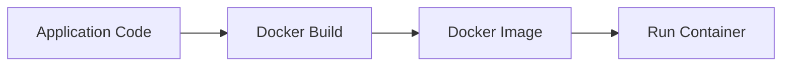
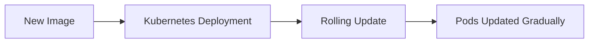
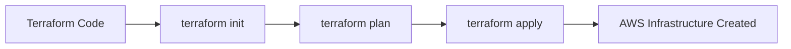
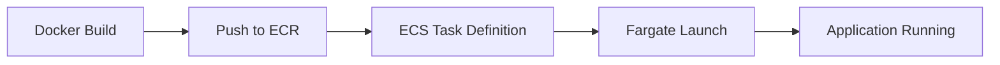
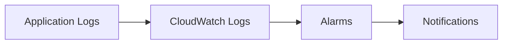
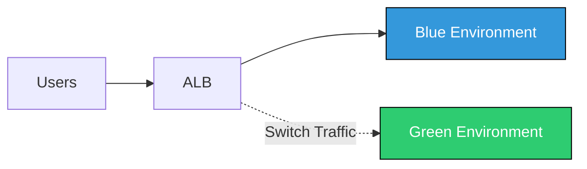

````markdown
# 🚀 CI/CD Projects Portfolio

Welcome to the **CI/CD Projects Repository** — a hands-on DevOps portfolio showcasing real-world Continuous Integration and Continuous Deployment implementations using AWS, Docker, Kubernetes, and Infrastructure as Code.

This repository demonstrates production-style deployment workflows from development to monitoring with zero-downtime strategies.

---

# 🌟 Repository Highlights

- 🔄 Fully Automated CI/CD Pipelines  
- 🐳 Containerized Application Deployments  
- ☁️ AWS Cloud-Native Architecture  
- 🏗️ Infrastructure as Code (Terraform)  
- 🔵🟢 Blue-Green Deployment Strategy  
- 📊 Monitoring, Logging & Observability  
- 🚀 Zero-Downtime Release Management  

---

# 📁 Projects Overview

| # | Project | Core Focus |
|---|----------|------------|
| 1 | Static Website (S3 + CloudFront) | CDN Deployment |
| 2 | GitHub Actions CI/CD | Automation Pipeline |
| 3 | Dockerized App Deployment | Containerization |
| 4 | Kubernetes Rolling Updates | Orchestration |
| 5 | Terraform IaC | Infrastructure Automation |
| 6 | AWS Fargate Deployment | Serverless Containers |
| 7 | CloudWatch Monitoring | Observability |
| 8 | Blue-Green ECS Deployment | Zero Downtime Strategy |

---

# 🏗️ Project 1: Static Website Deployment (S3 + CloudFront)

### 🎯 Objective
Deploy a globally distributed static website using Amazon S3 and CloudFront CDN.

### 🛠️ Tools
- Amazon S3  
- CloudFront  
- IAM  

### 🔄 Architecture Flow

```mermaid
flowchart LR
    A[Developer Push Code] --> B[Upload to S3 Bucket]
    B --> C[CloudFront Distribution]
    C --> D[End Users Access Website]
````

---

# ⚙️ Project 2: CI/CD Pipeline using GitHub Actions

### 🎯 Objective

Automate build, test, and deployment workflows.

### 🔄 Pipeline Flow

```mermaid
flowchart LR
    A[Code Push] -->|Trigger| B[GitHub Actions]
    B --> C[Build]
    C --> D[Test]
    D --> E[Deploy]

    style A fill:#ffcc00,stroke:#333
    style B fill:#00c3ff,stroke:#333
    style C fill:#28a745,stroke:#333
    style D fill:#ff5733,stroke:#333
    style E fill:#8e44ad,stroke:#333
```

---

# 🐳 Project 3: Dockerized Application Deployment

### 🎯 Objective

Build, package, and deploy applications using Docker containers.



---

# ☸️ Project 4: Kubernetes Rolling Deployment

### 🎯 Objective

Implement zero-downtime rolling updates in Kubernetes.



---

# 🏗️ Project 5: Infrastructure as Code (Terraform)

### 🎯 Objective

Provision and manage AWS infrastructure programmatically.



---

# 🚀 Project 6: Containerized Deployment with AWS Fargate

### 🎯 Objective

Deploy containers without managing EC2 instances.



---

# 📊 Project 7: Monitoring & Logging with CloudWatch

### 🎯 Objective

Implement centralized logging and automated alerting.



---

# 🔵🟢 Project 8: Blue-Green Deployment on AWS ECS

### 🎯 Objective

Deploy new versions without downtime using traffic shifting.



---


# 🧠 DevOps Skills Demonstrated

* CI/CD Pipeline Design
* GitHub Actions Automation
* Docker & Containerization
* Kubernetes Orchestration
* AWS ECS & Fargate
* Terraform Infrastructure as Code
* CloudWatch Monitoring & Alerts
* Blue-Green Deployment Strategy
* Production-Grade Deployment Architecture

---

# 📌 CI/CD Master Flow

Developer → Version Control → CI Build → Test → Containerize → Push → Deploy → Monitor → Rollback

---

# 👨‍💻 Author

DevOps & Cloud Engineer
CI/CD Enthusiast
AWS Practitioner

---

⭐ If this repository helped you, consider starring the project!

Happy Deploying 🚀


Just tell me which one you want 👌
```
